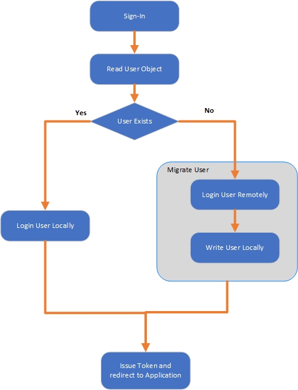

# JIT Migrate from one B2C Instance to another
> Disclaimer: This sample is provided AS IS - a best effort will be made to update this sample as the service evolves.

This sample solution demonstrates how to migrate users from one B2C instance to another using Just In Time (JIT) Migration.
The policy will check to see if the user exists in the current tenant, and if they exist then the normal authenication rocess is followed (login-Noninteractive).
If the user does not exist within the curren tenant a seperate Remote login call is made to the legacy B2C instance using ROPC.
On successfull Authenitcaion to the legacy tenant, the user details (including password) are written to the local Tenant.

On next login the user will exist in the tenant so the normal authenticaiton procss will be followed.

The following diagram illustrates the migration flow:

To configure this solution, you will need to use Azure AD B2C Custom policies that use the Azure AD B2C Identity Experience Framework.  Review the getting started with custom B2C applications:
https://docs.microsoft.com/en-us/azure/active-directory-b2c/active-directory-b2c-get-started-custom?tabs=applications

This example builds upon the Social and Local Display Control Starter pack sample which can be found here - [SocialAndLocalAccounts](https://github.com/Azure-Samples/active-directory-b2c-custom-policy-starterpack/tree/master/Display%20Controls%20Starterpack/SocialAndLocalAccounts)

## Configure the sample

The following chnages will need to be made to [B2CMigrate_Extensions](policy/B2CMigrate_Extensions.xml) file:
1. Change the refernces from "yourtenant.onmicrosoft.com" to the name of your B2C Tenant.
1. Change the refernce from "remoteb2ctenant" on Lines [36](policy/B2CMigrate_Extensions.xml#L36) and [37](policy/B2CMigrate_Extensions.xml#L37) to your legacy B2C tenant name.
1. Change the reference of "RemoteB2CProxyIdentityExperienceFrameworkAppId" on Lines [44](policy/B2CMigrate_Extensions.xml#L44) and [53](policy/B2CMigrate_Extensions.xml#L53) to the Proxy Identitiy Experience Framework Applicaiton Objects Client Id from your legacy tenant.
1. Change the reference of "RemoteB2CIdentityExperienceFrameworkAppId" on Lines [45](policy/B2CMigrate_Extensions.xml#L45) and [54](policy/B2CMigrate_Extensions.xml#L54) to the Identitiy Experience Framework Applicaiton Objects Client Id from your legacy tenant.

## Community Help and Support
Use [Stack Overflow](https://stackoverflow.com/questions/tagged/azure-ad-b2c) to get support from the community. Ask your questions on Stack Overflow first and browse existing issues to see if someone has asked your question before. Make sure that your questions or comments are tagged with [azure-ad-b2c].

If you find a bug in the sample, please raise the issue on [GitHub Issues](https://github.com/azure-ad-b2c/samples/issues).

To provide product feedback, visit the [Azure Active Directory B2C Feedback page](https://feedback.azure.com/forums/169401-azure-active-directory?category_id=160596).
